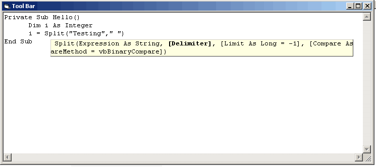



## help tool tip \(like in VB\)

### Description

tool tip it like you type Split and (

then it will show the help like Split(Expression As String, [Delimiter], [Limit As Long = -1], [Compare As VbCompareMethod = vbBinaryCompare])

like in VB
 
### More Info
 

             |
---                |---
**Submitted On**   |2004-10-07 11:30:46
**By**             |[Visal \.In](https://github.com/Planet-Source-Code/PSCIndex/blob/master/ByAuthor/visal-in.md)
**Level**          |Intermediate
**User Rating**    |4.8 (58 globes from 12 users)
**Compatibility**  |VB 6\.0
**Category**       |[String Manipulation](https://github.com/Planet-Source-Code/PSCIndex/blob/master/ByCategory/string-manipulation__1-5.md)
**World**          |[Visual Basic](https://github.com/Planet-Source-Code/PSCIndex/blob/master/ByWorld/visual-basic.md)
**Archive File**   |[help\_tool\_1802161072004\.zip](https://github.com/Planet-Source-Code/visal-in-help-tool-tip-like-in-vb__1-56580/archive/master.zip)

